#模拟天体系统#
---------------
作者：陈少鹏（Lessmoon）、杨金智（Wiskey） 
基于OpenGL与MFC的一个简易天体模拟系统

##功能说明##
- **W/Up** 键：拉近摄像机(观察者的位置)
- **S/Down** 键：拉远摄像机
- **A/Left** 键：摄像机围绕中心天体，左旋转
- **D/Right** 键：摄像机围绕中心天体，右旋转
- **Space** 键：旋转摄像机（改变向上的方向向量）
- **鼠标滚轮** ：拉近(远)摄像机
- **鼠标拖拽** ：自由改变摄像机的位置

##配置文件##
###样例文件###
>set zoom = 16000000  
set speed = 1500  
set center = < mass =5.975E24, color = <0,254,128> >  
add planet =  
<  
color = <0,0,255>,  
radius = 1.5,  
velocity = <0,1000,0>,  
mass = 0,  
pos = <363104000,0,0>  >

###设置该系统与真实系统的比例###
	#距离缩小比例（距离比例尺），默认值为：16E6
	set zoom = 16000000 
	#时间缩小比例（时间比例尺），默认值为：1000
	set speed = 1500    

###设置中心天体###

	#中心天体质量为mass, 颜色为color <R, G, B>
	#默认值为：mass = 5.975E24, color = <0,254,128> 
	set center = < mass =5.975E24, color = <0,254,128> >

###其它天体的属性
	#添加天体
	#颜色color， 半径radius， 速度velocity <vx, vy, vz>
	#质量mass, 位置坐标pos <x, y, z>
	add planet = <	
		color = <0,0,255>,
		radius = 1.5,
		velocity = <0,1000,0>,
		mass = 0,
		pos = <363104000,0,0>
		>

##原理##
###天体轨迹计算###
公式：

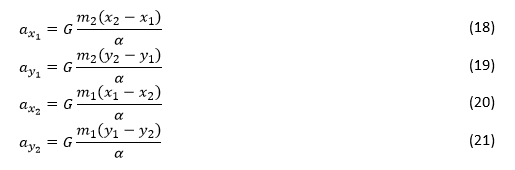
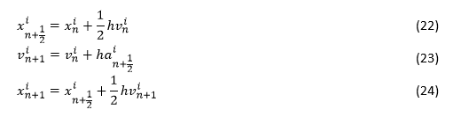
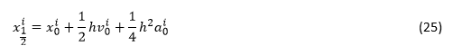
>
**1.** 为 h (Δt) 选择一个较小的值。 
**2.** 选择所有质量体的初始（分量形式）位置和速度值。 
**3.** 使用等式 18 到 21 计算初始加速度值。 
**4.** 采用来自之前步骤的 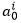 值，使用等式 25 计算初始 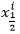 值。 
**5.** 采用之前算出的  值，使用等式 18 到 21 计算 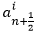 值。 
**6.** 采用来自之前步骤的  值，使用等式 23 计算 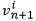 值 
**7.** 采用来自之前步骤的  值，使用等式 24 计算  值。 
**8.** 采用来自之前步骤的 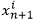 值，使用等式 22 计算 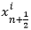 值。 
**9.** 转到步骤 5，直到用户选择停止为止。 

[参考文献：双体和三体问题的物理特征和等式](http://msdn.microsoft.com/zh-cn/library/ie/dn528554(v=vs.85).aspx)

###摄像机坐标变换###

####坐标变换函数：将`point`关于`scale`轴旋转`theta`角度####
	
	#point：被旋转坐标<x, y, z>
	#theta：旋转角度
	#scale：旋转轴（三维向量<Xn, Yn, Zn>)
	void RotateAs(point, theta, scale)

旋转后坐标`<x'， y'， z'>`通过下面公式计算
>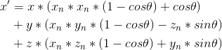
>
>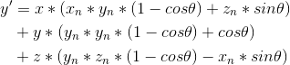
>
>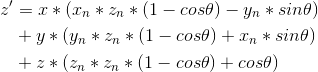

####拉近摄像机：####

可以通过以下公式拉近摄像机的位置: 
其中`h`为要前进的距离，可以为负值。
>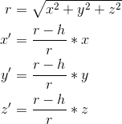

####旋转摄像机：####
我们称摄像机与绝对原点形成的向量为视线向量Z，称摄像机正上向量为头顶向量Y，称摄像机左边为右手向量X。 
采用之前所述的旋转操作，可以实现以下三种操作： 
**1.** 绕Z轴旋转摄像机，对应Space的操作

	Z'  = Z 
	Y'  = RotateAs(Y,theta,Z)
	X'  = RotateAs(X,theta,Z)

**2.** 绕Y轴旋转摄像机，对应鼠标向上向下拖拽

	Y' = Y
	Z' = RotateAs(Z,theta,Y)
	X' = RotateAs(X,theta,Y)

**3.** 绕X轴旋转摄像机，对应Left,Right的操作

	X' = X
	Y' = RotateAs(Y,theta,X)
	Z' = RotateAs(Z,theta,X)

